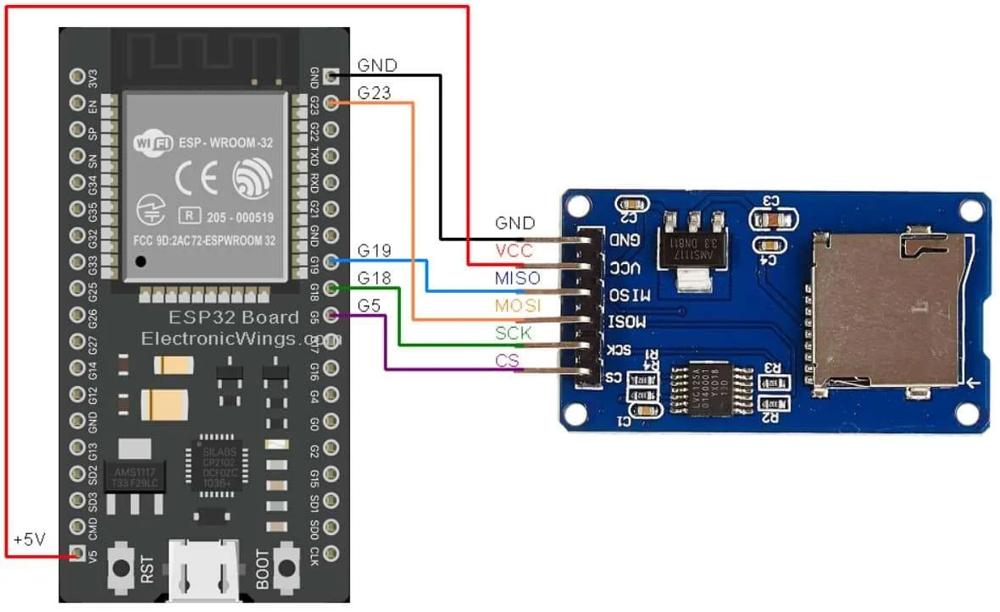

# ESP32-SDCard-WiFi-Logger
A simple data logger using **ESP32** and **Micro SD card adapter** that logs data to a CSV file and hosts a **WiFi web server** to view or download the file directly from a browser.

## Features
- Logs sensor or random data into `data.csv` on SD card.
- Hosts a **web server** on ESP32 to access logged data.
- Provides a **Download button** for saving the CSV to your laptop or phone.
- Supports **static IP configuration** for easy access.
- Responsive web page design (works on mobile and desktop).

## Hardware Required
- ESP32 Development Board
- Micro SD card module (SPI mode)
- Micro SD card (formatted FAT32)
- Jumper wires

## Pin Connections (SPI)
| SD Module | ESP32 Pin |
|-----------|-----------|
| CS        | GPIO 5    |
| MOSI      | GPIO 23   |
| MISO      | GPIO 19   |
| SCK       | GPIO 18   |
| VCC       | 3.3V / 5V |
| GND       | GND       |

## Circuit Diagram



## Setup Instructions
1. Format your SD card as **FAT32**.
2. Connect SD card module to ESP32 according to pin table above.
3. Update WiFi credentials in the code:
   ```cpp
   const char* ssid = "YOUR_WIFI_NAME";
   const char* password = "YOUR_WIFI_PASSWORD";
## Reference

This project’s basic SD card interfacing method and circuit diagram are inspired by  
[ElectronicWings: MicroSD Card Interfacing with ESP32](https://www.electronicwings.com/esp32/microsd-card-interfacing-with-esp32)
